# Relatório – Proposta de Interface (1ª Fase)

**Interação Pessoa-Máquina — LEI 25/26 2S**

---

**Universidade do Minho**

Escola de Engenharia — Departamento de Informática

### Relatório – Proposta de Interface

**Interação Pessoa-Máquina — 1ª Fase**

Débora Caetano — Nº 112332  
Fábio Azevedo — Nº 111002  
Gonçalo Lemos — Nº 111759

[Protótipo Figma](https://www.figma.com/LINK_AQUI) <!-- TODO: substituir pelo link real -->

Ano Letivo 2025/2026 — 2.º Semestre

Março 2026

---

## Resumo

> No âmbito deste trabalho prático, foi prototipada uma interface de visualização de dados inspirada no *EU Recovery and Resilience Scoreboard*, que permite analisar o progresso dos Planos Nacionais de Recuperação e Resiliência dos Estados-Membros da União Europeia. Neste documento, apresenta-se a interface modelada com recurso à ferramenta Figma [\[1\]](#referências), justificando as várias decisões tomadas face aos perfis dos utilizadores da aplicação. Perante o grande volume e heterogeneidade dos dados envolvidos — marcos, metas, indicadores comuns e fluxos financeiros — o principal foco do desenvolvimento desta interface foi a apresentação desta informação de uma forma clara, acessível e sem sobrecarregar o utilizador, adotando uma estratégia de revelação progressiva (*progressive disclosure*). Foi também realizada uma avaliação da interface apresentada, fazendo uso das heurísticas de Nielsen [\[2\]](#referências). Apesar de algumas limitações da ferramenta de modelação, julga-se ter construído um protótipo de uma interface que cumpre os objetivos do enunciado, e que se encontra suficientemente detalhado para a sua implementação.

---

## Índice

- [1. Análise do Problema e do Domínio](#1-análise-do-problema-e-do-domínio)
  - [1.1 Tipos de Dados Relevantes](#11-tipos-de-dados-relevantes)
  - [1.2 Principais Desafios de Usabilidade](#12-principais-desafios-de-usabilidade)
- [2. Utilizadores e Levantamento de Requisitos](#2-utilizadores-e-levantamento-de-requisitos)
  - [2.1 Perfis de Utilizador e Necessidades Identificadas](#21-perfis-de-utilizador-e-necessidades-identificadas)
  - [2.2 Requisitos Funcionais](#22-requisitos-funcionais)
- [3. Apresentação da Interface Desenvolvida](#3-apresentação-da-interface-desenvolvida)
  - [3.1 Página "Dashboard Principal"](#31-página-dashboard-principal)
  - [3.2 Página "Lista de Países"](#32-página-lista-de-países)
  - [3.3 Página "Detalhe de País"](#33-página-detalhe-de-país)
  - [3.4 Funcionalidade "Comparar Países"](#34-funcionalidade-comparar-países)
  - [3.5 Página "Execução Global"](#35-página-execução-global)
- [4. Avaliação Heurística](#4-avaliação-heurística)
- [5. Conclusão e Trabalho Futuro](#5-conclusão-e-trabalho-futuro)
- [Referências](#referências)
---

## 1. Análise do Problema e do Domínio

O Mecanismo de Recuperação e Resiliência (MRR) constitui o instrumento central do programa *NextGenerationEU*, dotado de cerca de 724 mil milhões de euros em subvenções e empréstimos. Cada Estado-Membro submete um Plano Nacional de Recuperação e Resiliência (PRR) que define reformas e investimentos organizados em pilares temáticos — como a transição ecológica, a transformação digital, a coesão social e territorial, a saúde e resiliência, entre outros. O acompanhamento da execução destes planos gera um volume considerável de dados heterogéneos, cuja análise requer ferramentas de visualização adequadas [\[4\]](#referências).

### 1.1 Tipos de Dados Relevantes

A interface proposta trabalha sobre três categorias principais de dados, disponibilizadas pelo *EU Recovery and Resilience Scoreboard*:

- **Marcos e Metas (*Milestones and Targets*):** objetivos concretos que cada país se compromete a atingir, com descrição, prazo e estado de execução. Na interface, estes dados são apresentados sob a forma de percentagens de progresso (e.g., "75% — 39/52 Metas concluídas") e gráficos do tipo *donut* que ilustram o estado dos marcos (concluídos vs. em progresso).

- **Indicadores Comuns (*Common Indicators*):** conjunto de 14 indicadores de reporte obrigatório e semestral por todos os Estados-Membros, que permitem comparações transversais. A interface disponibiliza uma vista dedicada (separador "Indicadores") para consulta e filtragem destes dados.

- **Desembolsos e Beneficiários (*Disbursements*):** informação financeira detalhada sobre os pagamentos efetuados pela UE a cada país, incluindo montantes de apoios a fundo perdido, empréstimos atribuídos e alocação em relação ao PIB. Na interface, estes valores são apresentados em cartões de resumo na página de detalhe de cada país.

### 1.2 Principais Desafios de Usabilidade

Durante a conceção da interface, foram identificados os seguintes desafios:

- **Volume e complexidade dos dados** — a quantidade de indicadores, marcos e fluxos financeiros exige uma hierarquia de informação clara, evitando sobrecarregar o utilizador. Optou-se por uma estrutura em camadas: visão geral no *dashboard*, detalhe progressivo por país e separadores temáticos (Sumário, Pilares, Indicadores).

- **Heterogeneidade dos perfis de utilizador** — desde analistas com elevada literacia de dados até utilizadores menos técnicos, a interface deve ser simultaneamente rica e acessível. Foram adotados resumos visuais (percentagens, gráficos circulares) com possibilidade de aprofundamento.

- **Comparação entre países** — a necessidade de confrontar a execução de diferentes Estados-Membros motivou a inclusão de uma funcionalidade de comparação lado a lado, com seleção interativa de países e visualização paralela dos indicadores.

- **Exportação e reutilização** — vários perfis necessitam de extrair dados para análise externa ou apresentações, o que levou à inclusão de botões de exportação em múltiplas vistas da interface.

---

## 2. Utilizadores e Levantamento de Requisitos

### 2.1 Perfis de Utilizador e Necessidades Identificadas

Foram considerados três perfis de utilizador com contextos e objetivos distintos, cuja análise orientou todas as decisões de design da interface.

#### 2.1.1 Helena Vasconcelos — Analista de Políticas Públicas

- Exportação de dados em formatos editáveis (CSV, JSON) para cruzamento com outras fontes;
- Acesso a metas específicas por setor (e.g., digitalização) e histórico de revisões de planos;
- Filtragem avançada por múltiplos critérios em simultâneo (país, pilar, período temporal).

#### 2.1.2 Marco Rossi — Empreendedor em Energias Renováveis

- Visualizações claras de investimento por pilar e datas de desembolso previstas;
- Identificar quais os países com maior investimento em transição ecológica;
- Gráficos exportáveis para utilização em apresentações de *pitch* a investidores.

#### 2.1.3 Clara Mendes — Professora do Ensino Secundário

- Linguagem clara e sucinta, com infográficos intuitivos e resumos do impacto direto no quotidiano;
- Comparação regional (e.g., investimentos em *Policies for the Next Generation* entre Portugal e Espanha);
- Compreender se atrasos em promessas concretas (e.g., renovação de escolas) são um problema local ou generalizado.

### 2.2 Requisitos Funcionais

A partir da análise dos três perfis de utilizador, foram derivados os seguintes requisitos funcionais:

1. Filtrar dados por país, pilar temático, tipo de indicador e período temporal.
2. Visualizar o progresso de marcos e metas através de gráficos interativos.
3. Exportar dados em formato CSV, JSON e Excel, e gráficos em formato de imagem.
4. Comparar dois países lado a lado com indicadores alinhados.
5. Pesquisar países por nome com filtragem dinâmica.
6. Ordenar listas de países por diferentes critérios (nome, execução, desembolsos).
7. Alternar entre tema claro e tema escuro.
8. Aceder a documentação contextual sobre o MRR e a metodologia dos indicadores.
9. Consultar detalhes de indicadores com *tooltips* explicativas.
10. Navegar entre secções sem perder o contexto da análise em curso.

---

## 3. Apresentação da Interface Desenvolvida

A arquitetura de navegação da aplicação é deliberadamente pouco profunda: a partir da barra de navegação principal, é possível aceder diretamente a todas as secções da aplicação (*Home*, *Países*, *Execução*, *Métricas* e *Documentação*), garantindo que o utilizador nunca se encontra a mais de dois cliques de qualquer página. As páginas principais são acessíveis diretamente a partir da barra de navegação, e o fluxo de comparação entre países é o caminho mais longo da aplicação, mesmo assim com apenas três passos (lista de países → diálogo de seleção → vista de comparação). Esta baixa profundidade contribui para que o utilizador se sinta sempre orientado e em controlo da sua navegação.

### 3.1 Página "Dashboard Principal"

A primeira página apresentada ao utilizador após aceder à aplicação é o *dashboard* principal, que oferece uma visão agregada do estado de execução dos Planos de Recuperação e Resiliência a nível europeu. Tendo em conta que os três perfis de utilizador definidos — a Helena (analista), o Marco (empreendedor) e a Clara (professora) — têm como necessidade comum obter uma visão geral rápida antes de aprofundar a análise, decidiu-se que esta seria a página inicial da aplicação:

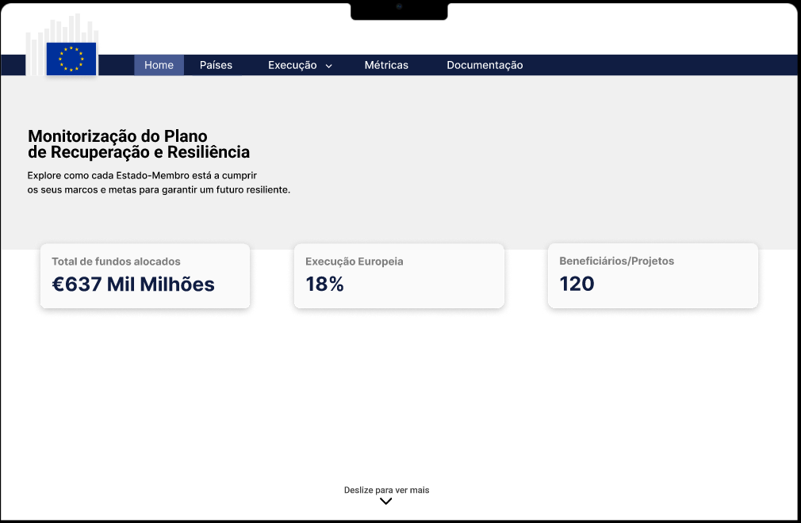

**Figura 1:** Captura de ecrã do protótipo da página "Dashboard Principal".

A página é constituída por três elementos principais. No topo, uma barra de navegação horizontal permanente permite aceder a todas as secções da aplicação: *Home*, *Países*, *Execução*, *Métricas* e *Documentação*. A entrada *Execução* inclui um *dropdown* com sub-secções — Visão geral, Metas e Marcos, Desembolsos e Linha Temporal — permitindo aceder diretamente ao tipo de análise pretendido. A página onde o utilizador se encontra é realçada com uma cor de fundo diferente das restantes, para que o utilizador saiba sempre em que secção está — uma decisão consistente com o que se observa em diversas outras interfaces *web*.

Abaixo da barra de navegação, são apresentados três cartões de resumo com indicadores-chave: o total de fundos alocados ao MRR, a percentagem de execução europeia e o número de beneficiários/projetos. Estes cartões permitem que o utilizador, num relance, avalie o estado global do programa sem necessidade de interação adicional — algo especialmente importante para o perfil da Clara, que pode ter menos disponibilidade para explorações aprofundadas.

A parte inferior da página é ocupada por um mapa interativo da Europa e por uma lista resumida dos países com melhor desempenho (*Top 3*). O mapa oferece uma entrada visual e familiar para a navegação por país: ao sobrevoar um Estado-Membro com o cursor, a sua área é realçada com uma mudança de cor, e o ícone do cursor muda para o dedo indicador, sinalizando que é possível clicar para aceder ao detalhe desse país:

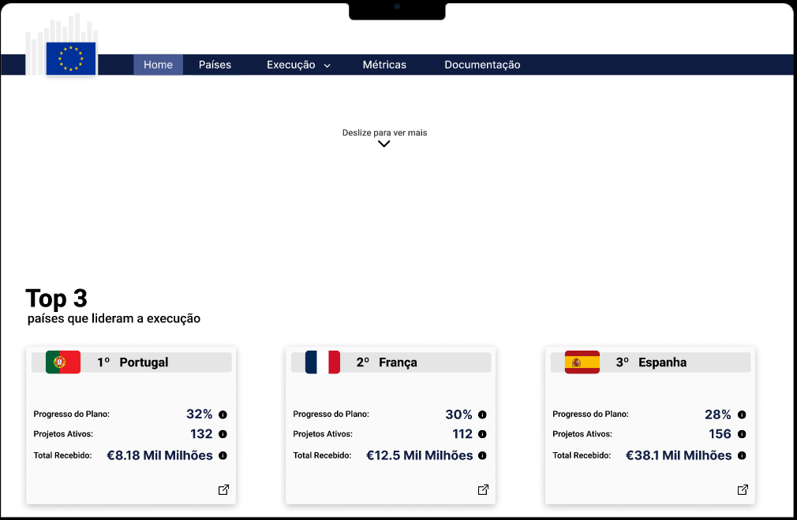

**Figura 2:** Vista do mapa interativo e Top 3 no *dashboard* principal.

Apesar de esta iconografia ser familiar, após sobrevoar um país por algum tempo, uma *tooltip* deve aparecer com o nome do país e a sua percentagem de execução, para auxiliar utilizadores menos familiarizados com a geografia europeia.

Adicionalmente, o utilizador pode optar por pesquisar um país diretamente através da barra de pesquisa disponível na parte superior dos conteúdos da página, permitindo uma navegação eficiente para utilizadores que sabem exatamente que país pretendem consultar — um atalho particularmente útil para o perfil da Helena.

### 3.2 Página "Lista de Países"

Para utilizadores que prefiram uma navegação por lista em vez de por mapa, a página "Países" apresenta todos os Estados-Membros de forma tabular, com a possibilidade de ordenação e filtragem:

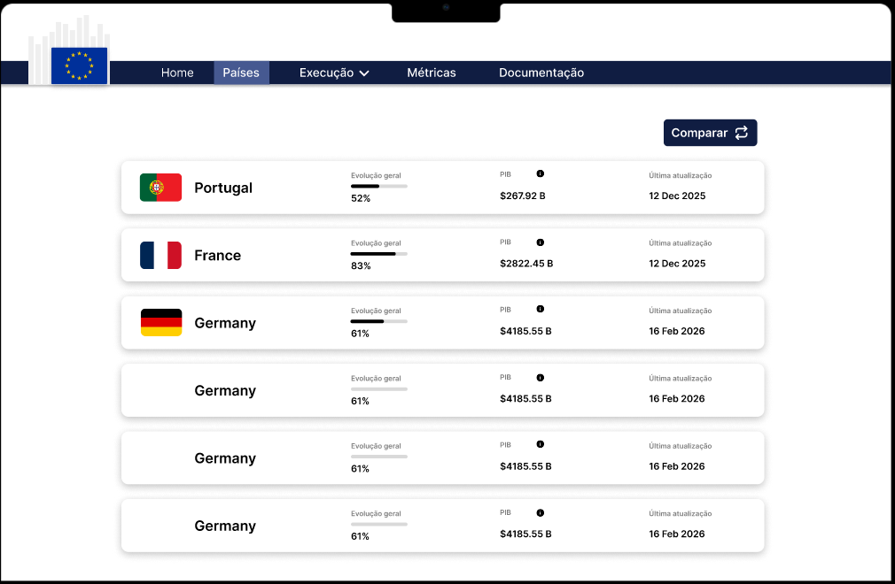

**Figura 3:** Captura de ecrã do protótipo da página "Lista de Países".

Cada entrada da lista apresenta a bandeira do país, o seu nome, a percentagem de marcos e metas concluídos e o montante total de desembolsos recebidos. A utilização de bandeiras em conjunto com os nomes dos países garante que o utilizador não precisa de memorizar códigos ISO ou abreviaturas — princípio do reconhecimento em vez de recordação.

No topo da lista, encontra-se uma barra de pesquisa com filtros, que permite ao utilizador reduzir o conjunto de países apresentados com base em critérios como o pilar dominante, a faixa de execução ou a região geográfica. Esta funcionalidade é especialmente relevante para a Helena, que necessita de cruzar dados entre múltiplos países de uma forma eficiente. A ordenação por diferentes colunas (nome, execução, desembolsos) é ativada clicando nos cabeçalhos da tabela, cujo cursor muda para indicar a possibilidade de interação.

Quando se clica num país, o utilizador é redirecionado para a página de detalhe desse país. Para ser claro que esta ação é possível, toda a linha muda de tom ao ser sobrevoada pelo cursor, de forma consistente com o comportamento do mapa no *dashboard*.

A página também inclui um botão "Comparar" que inicia o fluxo de comparação entre dois países, descrito mais adiante.

### 3.3 Página "Detalhe de País"

Quando o utilizador seleciona um país — seja a partir do mapa, da lista ou de uma pesquisa — é redirecionado para a sua página de detalhe, o elemento central da interface. A página está organizada em três separadores — **Sumário**, **Pilares** e **Indicadores** — acessíveis através de abas na parte superior do conteúdo. O separador ativo é realçado com uma cor de fundo distinta e um sublinhado, permitindo ao utilizador saber sempre que tipo de informação está a consultar. Esta organização em separadores permite apresentar um grande volume de informação sem sobrecarregar o utilizador, seguindo o princípio da revelação progressiva.

#### 3.3.1 Separador "Sumário"

O separador "Sumário" apresenta uma visão global do plano do país selecionado. No topo, são exibidos cartões com indicadores financeiros — total de apoios a fundo perdido, empréstimos atribuídos e alocação em relação ao PIB:

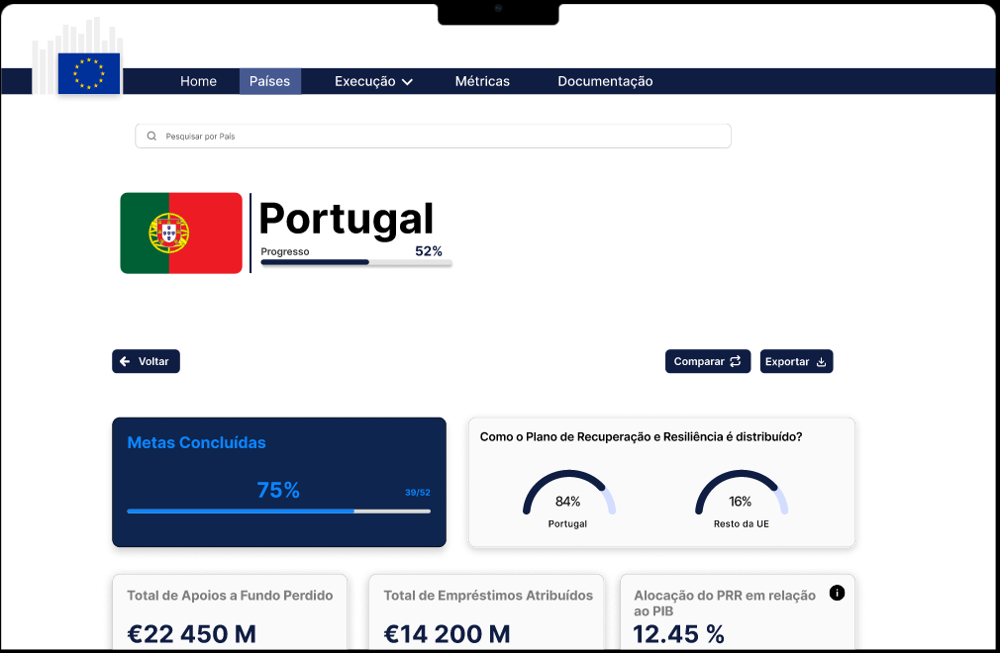

**Figura 4:** Página de detalhe de um país — separador "Sumário" (parte superior).

Junto a métricas que podem ser menos intuitivas, como "Alocação do PRR em relação ao PIB", são colocados ícones de informação ("i") que, ao serem sobrevoados, revelam *tooltips* explicativas. Este detalhe é particularmente importante para o perfil da Clara, que pode não estar familiarizada com estes conceitos financeiros.

Abaixo dos cartões, um gráfico do tipo *donut* apresenta a percentagem de marcos e metas concluídos versus em progresso, oferecendo uma representação visual imediata do estado de execução. Ao lado, uma barra de progresso animada reforça esta informação de forma textual (e.g., "75% — 39/52 Metas concluídas"), para que a mesma informação seja acessível em dois formatos complementares:

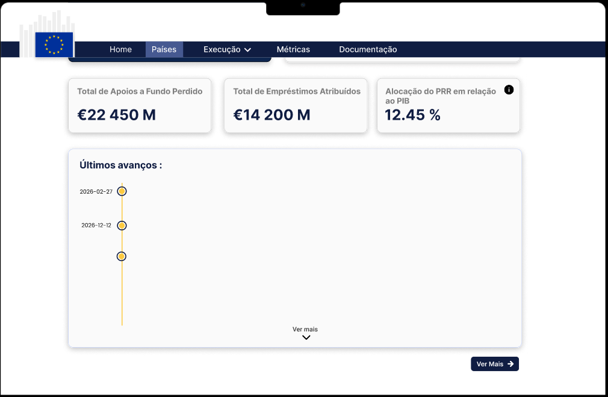

**Figura 5:** Página de detalhe de um país — separador "Sumário" (parte inferior).

#### 3.3.2 Separador "Pilares"

O separador "Pilares" permite ao utilizador explorar a composição temática do plano nacional. Cada pilar é representado como um *chip* clicável com ícone e nome (e.g., folha para "Transição Ecológica", ecrã para "Transformação Digital"). A figura seguinte mostra a vista de seleção de pilares:

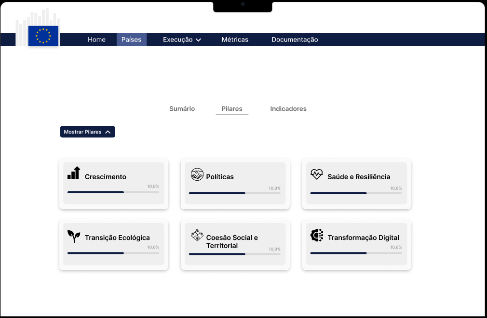

**Figura 6:** Vista de seleção de pilares na página de detalhe de um país.

Quando o utilizador clica num pilar, os conteúdos abaixo são filtrados para mostrar apenas os marcos, metas e investimentos associados a esse pilar. É possível selecionar mais do que um pilar em simultâneo para uma análise comparativa. Para indicar quais os pilares ativos, os *chips* selecionados são apresentados com uma cor de fundo preenchida, enquanto os restantes mantêm apenas o contorno — uma distinção visual clara que não depende exclusivamente de cor, melhorando a acessibilidade para utilizadores daltónicos. De seguida, apresentam-se duas capturas de ecrã que ilustram a informação apresentada após a seleção de pilares:

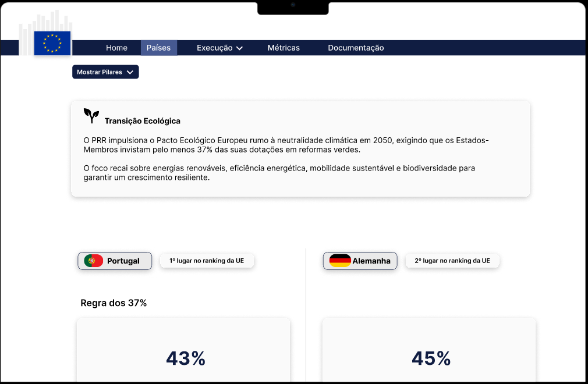

**Figura 7:** Informação detalhada dos pilares selecionados (parte 1).

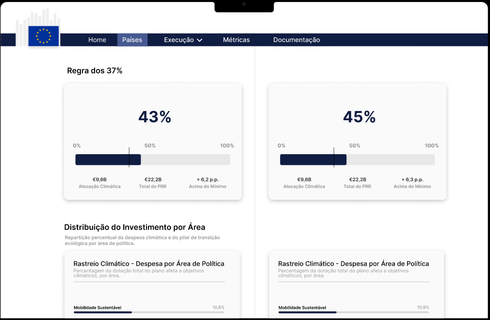

**Figura 8:** Informação detalhada dos pilares selecionados (parte 2).

### 3.4 Funcionalidade "Comparar Países"

Uma das funcionalidades mais relevantes da interface é a possibilidade de comparar dois países lado a lado. Esta funcionalidade pode ser iniciada a partir de um botão "Comparar" disponível na lista de países ou na página de detalhe de um país. Ao clicar neste botão, é aberto o seguinte diálogo:

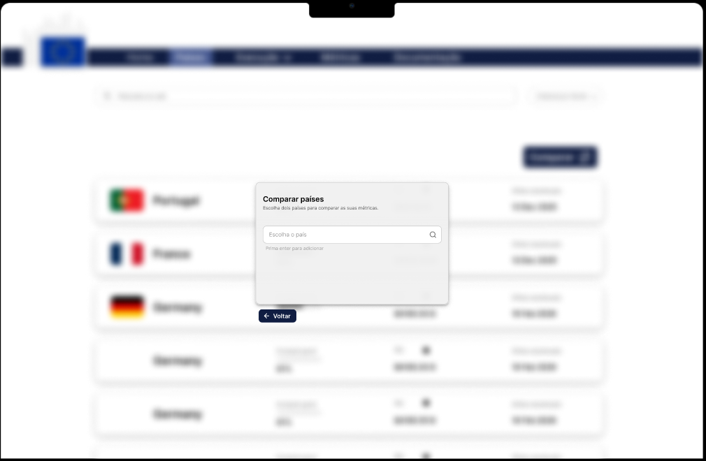

**Figura 9:** Diálogo de seleção de países para comparação.

O diálogo apresenta dois campos de seleção com barra de pesquisa, onde o utilizador deve selecionar exatamente dois países. A lista de países é filtrada à medida que o utilizador digita, reduzindo a possibilidade de seleção incorreta. Quando os dois países foram selecionados, um botão "Comparar" fica ativo; caso contrário, o botão permanece desativado (esbatido), com uma *tooltip* indicando "Selecione dois países para prosseguir". Este mecanismo de prevenção de erros evita que o utilizador inicie uma comparação incompleta.

Após confirmar a seleção, o utilizador é redirecionado para a vista de comparação:

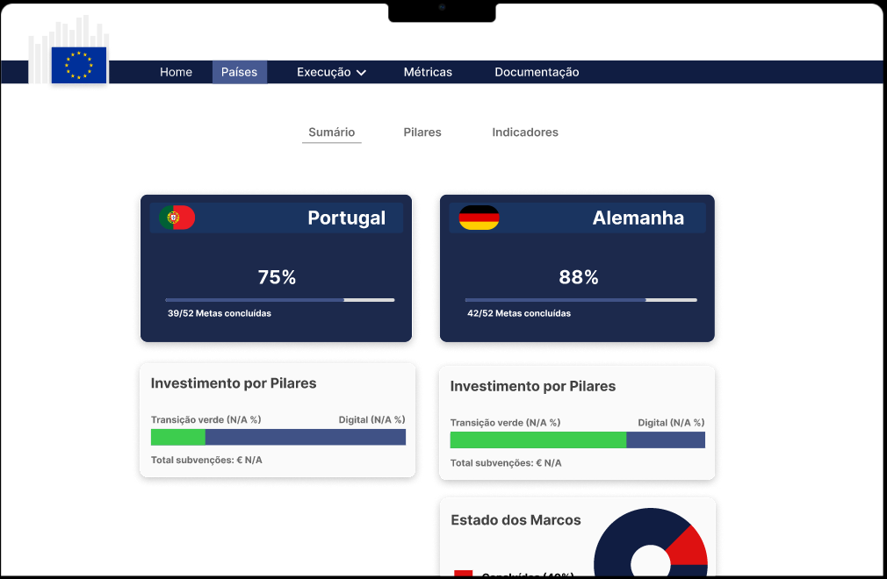

**Figura 10:** Captura de ecrã da vista de comparação lado a lado entre dois países.

A vista de comparação organiza os dados dos dois países selecionados em duas colunas paralelas, com os mesmos indicadores alinhados horizontalmente. Deste modo, é possível comparar visualmente os valores sem necessidade de alternância entre páginas ou memorização de valores, respeitando o princípio de reconhecimento em vez de recordação. A paleta de cores distingue cada país com um tom diferente (e.g., azul para o país da esquerda e verde para o da direita), mantendo esta codificação ao longo de toda a vista para garantir consistência.

No topo da página de comparação, os nomes e bandeiras de ambos os países são apresentados, junto com um botão para trocar os países na comparação ou para alterar a seleção, voltando ao diálogo anterior. Esta flexibilidade permite ao utilizador explorar diversas combinações sem necessidade de reiniciar todo o processo.

### 3.5 Página "Execução Global"

A página "Execução" oferece uma panorâmica do progresso de execução de todos os Estados-Membros, organizando a informação sob a forma de uma tabela detalhada, gráficos de barras, *rankings* e mapas coropléticos:

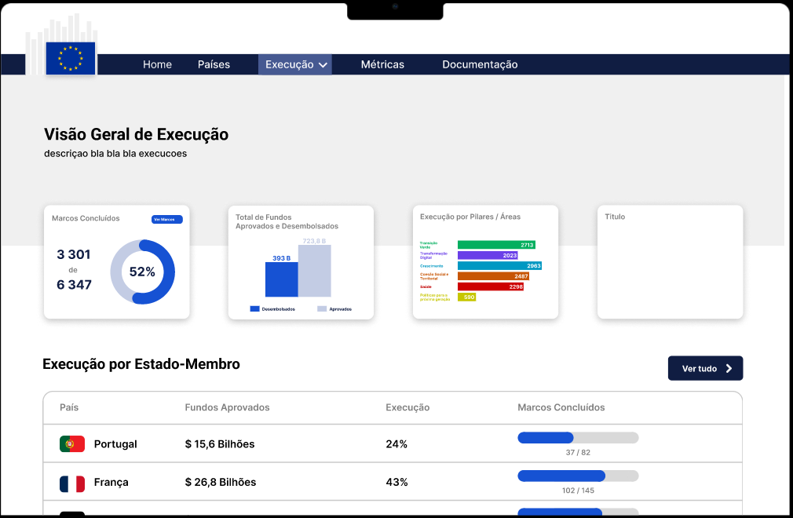

**Figura 11:** Captura de ecrã do protótipo da página "Execução Global".

No topo da página, um gráfico de barras horizontal apresenta a percentagem de execução de cada país, ordenado do maior para o menor. As barras são coloridas com um gradiente que facilita a distinção entre países com alta e baixa execução. Ao sobrevoar qualquer barra, uma *tooltip* apresenta o valor exato e o número de marcos e metas concluídos, evitando a necessidade de representar esta informação textualmente no gráfico — o que o sobrecarregaria visualmente.

A página inclui também uma vista tabular — "Execução por Estado-Membro" — que lista todos os países com os respetivos fundos aprovados, percentagem de execução e progresso de marcos concluídos, representado por uma barra de progresso e a fração correspondente (e.g., "76/108"). A tabela é ordenável por qualquer coluna, como indicado pela seta junto ao cabeçalho "País", permitindo ao utilizador reorganizar a informação segundo o critério mais relevante para a sua análise:

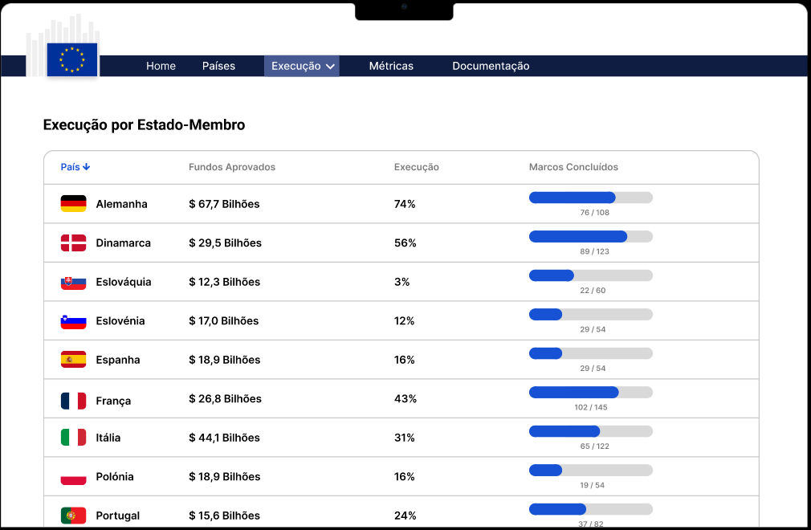

**Figura 12:** Vista tabular da execução por Estado-Membro na página "Execução Global".

Abaixo do gráfico, um mapa coroplético da Europa apresenta a mesma informação de forma geográfica, com uma escala de cores que vai do vermelho (baixa execução) ao verde (alta execução). A legenda da escala de cores é apresentada junto ao mapa e pode ser ajustada pelo utilizador (alterando o intervalo de valores), oferecendo flexibilidade para análises mais específicas.

---

## 4. Avaliação Heurística

A interface foi avaliada com recurso às Heurísticas de Nielsen [\[2\]](#referências). Cada elemento do grupo avaliou os fluxos em que menos participou, e os problemas encontrados foram corrigidos ou registados como melhorias futuras.

### 4.1 Visibilidade do Estado do Sistema

O *dashboard* apresenta de imediato indicadores-chave (fundos alocados, execução, marcos concluídos). Na página de detalhe, barras de progresso comunicam o estado de execução instantaneamente. Na filtragem de dados, *chips* com os filtros ativos garantem visibilidade sobre os critérios aplicados. **Melhoria futura:** adicionar *spinners* de carregamento para conexões lentas.

### 4.2 Correspondência com o Mundo Real e Reconhecimento em vez de Recordação

A terminologia utilizada é familiar ao domínio ("Marcos", "Metas", "Pilares", "Desembolsos"), e bandeiras nacionais, ícones temáticos e mapas interativos tiram partido do conhecimento prévio dos utilizadores. Os tipos de gráfico escolhidos (barras, *donuts*, coropléticos) são amplamente conhecidos, garantindo acessibilidade mesmo para utilizadores como a Clara. Os pilares são apresentados como *tags* com ícone e nome, dispensando memorização; na lista de países, bandeiras e indicadores são visíveis sem interação, e na comparação os dados alinhados lado a lado eliminam a necessidade de memorizar valores.

### 4.3 Controlo, Liberdade e Flexibilidade de Utilização

A barra de navegação principal está sempre visível, permitindo regressar a qualquer secção, e no fluxo de comparação é possível alterar a seleção sem reiniciar o processo. A pesquisa por nome e os filtros rápidos servem utilizadores experientes como a Helena, enquanto a navegação sequencial e o *ranking* Top 3 servem utilizadores menos experientes. A exportação de dados filtrados poupa tempo a quem sabe o que procura. **Melhorias futuras:** botão "Voltar ao topo" em páginas com *scroll* extenso e atalhos de teclado para ações frequentes.

### 4.4 Consistência e Normas

A barra de navegação, cartões de resumo, botões de ação e separadores mantêm-se idênticos em todos os ecrãs. A iconografia segue as *Material Icons* [\[3\]](#referências), e os efeitos de *hover* são uniformes em todos os elementos clicáveis. Optou-se por um *dropdown* (em vez de diálogo) para exportação, priorizando rapidez sobre consistência total com o fluxo de comparação.

### 4.5 Prevenção e Recuperação de Erros, Ajuda e Documentação

Na comparação de países, o botão "Comparar" fica desativado até dois países serem selecionados, e conjuntos vazios de resultados apresentam uma mensagem informativa com sugestões de ação em vez de uma tabela vazia. Ícones "i" junto a métricas menos intuitivas fornecem *tooltips* explicativas, e *tooltips* contextuais proporcionam micro-ajuda *inline* sem abandonar o contexto da análise.

### 4.6 Estética e Desenho Minimalista

Paleta contida (azul-escuro, branco, acentos subtis), tipografia limpa e espaçamento generoso. Separadores e secções colapsáveis dividem grandes volumes de dados em vistas coerentes. *Tooltips* complementam elementos visuais sem poluir a interface permanentemente.

---

## 5. Conclusão e Trabalho Futuro

Ao longo das últimas semanas, foi prototipada uma interface para uma plataforma de visualização de dados sobre a execução dos Planos Nacionais de Recuperação e Resiliência. Os três perfis de utilizador fornecidos — a Helena, o Marco e a Clara — foram utilizados para modelar a interface com base nas características e necessidades destes utilizadores hipotéticos, garantindo que a solução responde a diferentes níveis de literacia de dados e diferentes objetivos de utilização.

O protótipo desenvolvido em Figma [\[1\]](#referências) cobre os fluxos principais da aplicação: consulta do *dashboard* global, navegação por país, exploração de indicadores, comparação entre Estados-Membros e exportação de dados. Por fim, foi feita uma análise heurística da interface prototipada com base nas heurísticas de Nielsen [\[2\]](#referências), tendo sido identificados e corrigidos alguns problemas. Foram também identificados aspetos menos críticos — como a adição de indicadores de carregamento, atalhos de teclado e páginas de erro — que não implicam grandes alterações à arquitetura atual da interface e podem ser abordados na próxima iteração.

Para a segunda fase deste trabalho prático, a interface será implementada com integração de dados reais via a API do *EU Recovery and Resilience Scoreboard*, passando de protótipo estático a aplicação funcional. Nessa fase, será também possível realizar testes com utilizadores reais, complementando a avaliação heurística com dados empíricos sobre a usabilidade da interface.

---

## Referências

1. Figma, "Figma: Collaborative Interface Design Tool." [Online]. Available: <https://www.figma.com/>
2. Nielsen Norman Group, "10 Usability Heuristics for User Interface Design." [Online]. Available: <https://www.nngroup.com/articles/ten-usability-heuristics/>
3. Google Fonts, "Material Symbols & Icons." [Online]. Available: <https://fonts.google.com/icons>
4. European Commission, "Recovery and Resilience Scoreboard." [Online]. Available: <https://ec.europa.eu/economy_finance/recovery-and-resilience-scoreboard/>
