# Relatório – Proposta de Interface (1ª Fase)

**Interface Pessoa-Máquina - LEI 25/26 2S**

---

**Universidade do Minho**

Escola de Engenharia - Departamento de Informática

### Relatório - Proposta de Interface

**Interface Pessoa-Máquina - 1ª Fase**

Débora Caetano - a112332  
Fábio Azevedo - a111002  
Gonçalo Lemos - a111759

[Protótipo Figma](https://www.figma.com/design/NQBXjODff0A4EqM7TQejJt/Projeto-IPM---dfg?node-id=0-1&t=lLzim3W78ALdneHY-1) 

Ano Letivo 2025/2026 - 2.º Semestre

Março 2026

---

## Introdução

No âmbito deste trabalho prático, foi prototipada uma interface de visualização de dados inspirada no *EU Recovery and Resilience Scoreboard*, que permite analisar o progresso dos Planos Nacionais de Recuperação e Resiliência dos Estados-Membros da União Europeia. Neste documento, apresenta-se a interface modelada com recurso à ferramenta Figma [\[1\]](#referências), justificando as várias decisões tomadas face aos perfis dos utilizadores da aplicação. Perante o grande volume de dados e dos seus tipos diferentes, (marcos, metas, indicadores comuns e fluxos financeiros) o principal foco do desenvolvimento desta interface foi a apresentação desta informação de uma forma clara, acessível e sem sobrecarregar o utilizador, adotando uma estratégia de revelação progressiva (*progressive disclosure*). Foi também realizada uma avaliação da interface apresentada, fazendo uso das heurísticas de Nielsen [\[2\]](#referências). Apesar de algumas limitações da ferramenta de modelação, julga-se ter construído um protótipo de uma interface que cumpre os objetivos do enunciado, e que se encontra suficientemente detalhado para a sua implementação.

### Objetivos da Interface

O objetivo desta interface é permitir a exploração clara e eficiente dos dados associados aos Planos de Recuperação e Resiliência dos Estados-Membros da União Europeia. A plataforma pretende facilitar a análise do progresso dos planos nacionais, a comparação entre países e a compreensão da distribuição de investimentos por áreas estratégicas. Para tal, a interface privilegia visualizações claras, mecanismos de filtragem e comparação, e uma organização hierárquica da informação que permita navegar entre diferentes níveis de detalhe sem sobrecarregar o utilizador.

---

## Índice

1. [Análise do Problema e do Domínio](#1-análise-do-problema-e-do-domínio)  
   1.1 [Tipos de Dados Relevantes](#11-tipos-de-dados-relevantes)  
   1.2 [Principais Desafios de Usabilidade](#12-principais-desafios-de-usabilidade)  

2. [Utilizadores e Levantamento de Requisitos](#2-utilizadores-e-levantamento-de-requisitos)  
   2.1 [Perfis de Utilizador e Necessidades Identificadas](#21-perfis-de-utilizador-e-necessidades-identificadas)  
   2.1.1 [Helena Vasconcelos - Analista de Políticas Públicas](#211-helena-vasconcelos---analista-de-políticas-públicas)  
   2.1.2 [Marco Rossi - Empreendedor em Energias Renováveis](#212-marco-rossi---empreendedor-em-energias-renováveis)  
   2.1.3 [Clara Mendes - Professora do Ensino Secundário](#213-clara-mendes---professora-do-ensino-secundário)  
   2.2 [Requisitos Funcionais](#22-requisitos-funcionais)  

3. [Apresentação da Interface Desenvolvida](#3-apresentação-da-interface-desenvolvida)  
   3.1 [Página "Início"](#31-página-início)  
   3.1.1 [Pequeno Resumo](#311-pequeno-resumo)  
   3.1.2 [Top 3](#312-top-3)  
   3.1.3 [Linha Temporal](#313-linha-temporal)  

   3.2 [Página "Países"](#32-página-países)  
   3.2.1 [Seleção de um País](#321-seleção-de-um-país)  
   3.2.2 [Histórico](#322-histórico)  
   3.2.3 [Comparar](#323-comparar)  

   3.3 [Página Execução](#33-página-execução)  
   3.3.1 [Visão Geral de Execução](#331-visão-geral-de-execução)  
   3.3.2 [Metas e Marcos](#332-metas-e-marcos)  
   3.3.3 [Desembolsos](#333-desembolsos)  

   3.4 [Página "Indicadores"](#34-página-indicadores)  
   3.5 [Página "Pilares"](#35-página-pilares)  
   3.6 [Rodapé (Footer)](#36-rodapé-footer)  

4. [Avaliação Heurística](#4-avaliação-heurística)  
   4.1 [Visibilidade do Estado do Sistema](#41-visibilidade-do-estado-do-sistema)  
   4.2 [Correspondência com o Mundo Real e Reconhecimento](#42-correspondência-com-o-mundo-real-e-reconhecimento-em-vez-de-recordação)  
   4.3 [Controlo, Liberdade e Flexibilidade](#43-controlo-liberdade-e-flexibilidade-de-utilização)  
   4.4 [Consistência e Normas](#44-consistência-e-normas)  
   4.5 [Prevenção e Recuperação de Erros](#45-prevenção-e-recuperação-de-erros-ajuda-e-documentação)  
   4.6 [Estética e Desenho Minimalista](#46-estética-e-desenho-minimalista)  

5. [Conclusão e Trabalho Futuro](#5-conclusão-e-trabalho-futuro)  

6. [Referências](#referências)

---

## 1. Análise do Problema e do Domínio

O Mecanismo de Recuperação e Resiliência (MRR) constitui o instrumento central do programa *NextGenerationEU*, dotado de cerca de 724 mil milhões de euros em subvenções e empréstimos. Cada Estado-Membro submete um Plano Nacional de Recuperação e Resiliência (PRR) que define reformas e investimentos organizados em pilares temáticos, como a transição ecológica, a transformação digital, a coesão social e territorial, a saúde e resiliência, entre outros. O acompanhamento da execução destes planos gera um volume considerável de dados heterogéneos, cuja análise requer ferramentas de visualização adequadas [\[4\]](#referências).

### 1.1 Tipos de Dados Relevantes

A interface proposta trabalha sobre três categorias principais de dados, disponibilizadas pelo *EU Recovery and Resilience Scoreboard*:

- **Marcos e Metas (*Milestones and Targets*):** objetivos concretos que cada país se compromete a atingir, com descrição, prazo e estado de execução. Na interface, estes dados são apresentados sob a forma de percentagens de progresso (e.g., "75% 39/52 Metas concluídas") e gráficos do tipo *donut* que ilustram o estado dos marcos (concluídos vs. em progresso).

- **Indicadores Comuns (*Common Indicators*):** conjunto de 14 indicadores de reporte obrigatório e semestral por todos os Estados-Membros, que permitem comparações transversais. A interface disponibiliza uma vista dedicada (separador "Indicadores") para consulta e filtragem destes dados.

- **Desembolsos e Beneficiários (*Disbursements*):** informação financeira detalhada sobre os pagamentos efetuados pela UE a cada país, incluindo montantes de apoios a fundo perdido, empréstimos atribuídos e alocação em relação ao PIB. Na interface, estes valores são apresentados em cartões de resumo na página de detalhe de cada país.

### 1.2 Principais Desafios de Usabilidade

Durante a conceção da interface, foram identificados os seguintes desafios:

- **Volume e complexidade dos dados:** a quantidade de indicadores, marcos e fluxos financeiros exige uma hierarquia de informação clara, evitando sobrecarregar o utilizador. Optou-se por uma estrutura em camadas: visão geral no *dashboard*, detalhe progressivo por país e separadores temáticos (Sumário, Pilares, Indicadores).

- **Heterogeneidade dos perfis de utilizador:**  desde analistas com elevada literacia de dados até utilizadores menos técnicos, a interface deve ser simultaneamente rica e acessível. Foram adotados resumos visuais (percentagens, gráficos circulares) com possibilidade de aprofundamento.

- **Comparação entre países:**  a necessidade de confrontar a execução de diferentes Estados-Membros motivou a inclusão de uma funcionalidade de comparação lado a lado, com seleção interativa de países e visualização paralela dos pilares.

- **Exportação e reutilização:** vários perfis necessitam de extrair dados para análise externa ou apresentações, o que levou à inclusão de botões de exportação em múltiplas vistas da interface.

---

## 2. Utilizadores e Levantamento de Requisitos

### 2.1 Perfis de Utilizador e Necessidades Identificadas

Foram considerados três perfis de utilizador com contextos e objetivos distintos, cuja análise orientou todas as decisões de design da interface.

#### 2.1.1 Helena Vasconcelos - Analista de Políticas Públicas

- Exportação de dados em formatos editáveis (CSV, JSON) para cruzamento com outras fontes;
- Acesso a metas específicas por setor (e.g., digitalização) 
- Histórico de revisões de planos.

#### 2.1.2 Marco Rossi - Empreendedor em Energias Renováveis

- Visualizações claras de investimento por pilar e datas de desembolso previstas;
- Identificar quais os países com maior investimento em transição ecológica;
- Gráficos exportáveis para utilização em apresentações de *pitch* a investidores.

#### 2.1.3 Clara Mendes - Professora do Ensino Secundário

- Linguagem clara e sucinta, com infográficos intuitivos e resumos do impacto direto no quotidiano;
- Comparação regional (e.g., investimentos em *Policies for the Next Generation* entre Portugal e Espanha);
- Compreender se atrasos em promessas concretas (e.g., renovação de escolas) são um problema local ou generalizado.

### 2.2 Requisitos Funcionais

A partir da análise dos três perfis de utilizador, foram derivados os seguintes requisitos funcionais:

1. Filtrar dados por país, pilar temático, tipo de indicador e período temporal.
2. Visualizar o progresso de marcos e metas através de gráficos interativos.
3. Exportar dados em formato CSV, JSON e Excel.
4. Comparar dois países lado a lado com dados alinhados.
5. Pesquisar países por nome com filtragem dinâmica.
6. Ordenar listas de países por diferentes critérios (nome, execução, desembolsos).
7. Aceder a documentação contextual sobre o MRR e a metodologia dos indicadores.
8. Consultar detalhes de indicadores com *tooltips* explicativas.
9. Navegar entre secções sem perder o contexto da análise em curso.

---

## 3. Apresentação da Interface Desenvolvida

A interface da plataforma encontra-se organizada em diferentes páginas, cada uma dedicada a um conjunto específico de funcionalidades relacionadas 
com a exploração dos dados do PRR.

No topo da aplicação encontra-se uma barra de navegação que permite aceder rapidamente às principais secções da plataforma, incluindo o 
dashboard principal, a lista de países, a página de execução, os indicadores e os pilares.

Esta organização procura facilitar a navegação e garantir que os utilizadores conseguem encontrar rapidamente a informação pretendida.

### 3.1 Página "Início"

Esta página constitui a página inicial da plataforma e apresenta uma visão geral do estado de implementação dos planos de recuperação na União Europeia.

Nesta página são apresentados diferentes elementos visuais que sintetizam informação relevante.

Estes elementos permitem ao utilizador obter rapidamente uma compreensão global da situação atual, funcionando como ponto de partida para uma exploração mais detalhada dos dados disponíveis na plataforma.

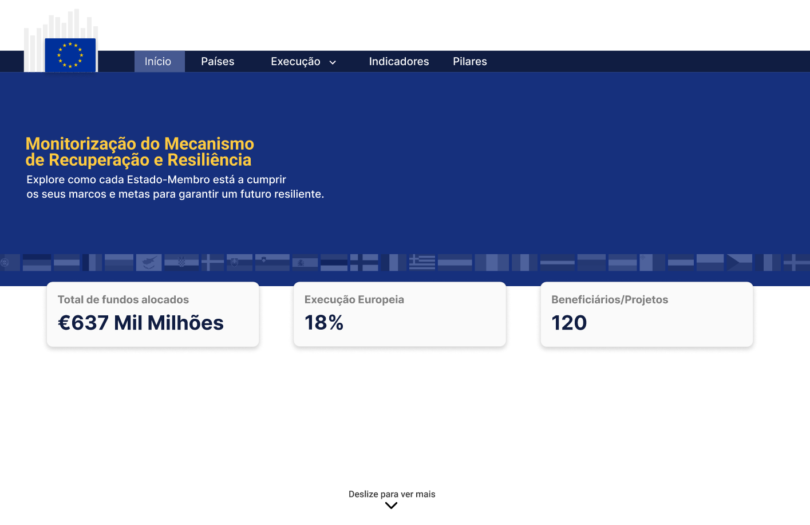
#### Figura 1: Captura de ecrã do prótipo da página "Início"

A página é constituída por três elementos principais.

No topo, uma barra de navegação horizontal permanente permite aceder a todas as secções da aplicação: *Home*, *Países*, *Execução*, *Indicadores* e *Pilares*. A entrada *Execução* inclui um *dropdown* com sub-secções, Visão geral, Metas e Marcos e Desembolsos, permitindo aceder diretamente ao tipo de análise pretendido. 

A página onde o utilizador se encontra é realçada com uma cor de fundo diferente das restantes, para que o utilizador saiba sempre em que secção está, uma decisão consistente com o que se observa em diversas outras interfaces *web*.

#### 3.1.1 Pequeno Resumo

Abaixo da barra de navegação, são apresentados três cartões de resumo com indicadores-chave: o total de fundos alocados ao MRR, a percentagem de execução europeia e o número de beneficiários/projetos. 

Estes cartões permitem que o utilizador, num relance, avalie o estado global do programa sem necessidade de interação adicional, algo especialmente importante para o perfil da **Clara**, que pode ter menos disponibilidade para explorações aprofundadas.

#### 3.1.2 Top 3

Abaixo dos cartões de indicadores globais, incluímos uma secção de 'Top 3', que destaca os Estados-Membros com maior execução através de cartões detalhados.

Esta escolha reduz a carga cognitiva, permitindo que utilizadores como a **Clara** identifiquem sucessos regionais sem navegar por tabelas complexas.

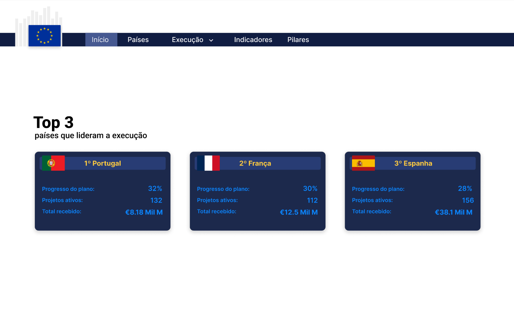
#### Figura 2: Captura de ecrã do Top 3

#### 3.1.3 Linha Temporal

Adicionalmente, implementámos uma Linha Temporal de 'Últimas Notícias'. 

Esta componente de feed informativo permite que a **Helena** acompanhe revisões de planos e novos pedidos de pagamento em tempo real, garantindo que o sistema comunica a visibilidade do estado do sistema de forma cronológica. 

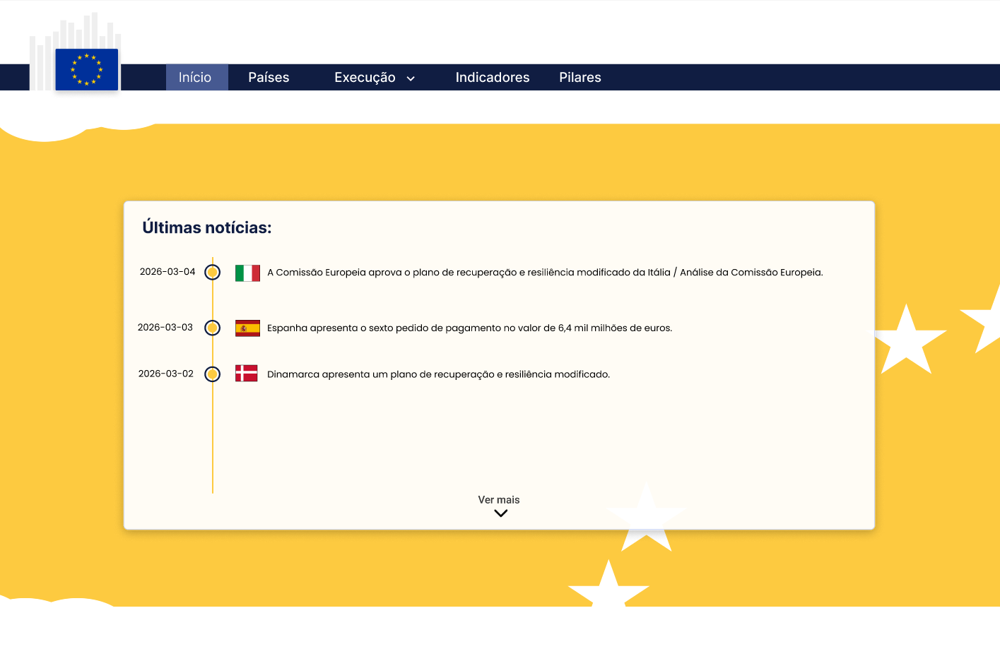
#### Figura 3: Captura de ecrã da linha temporal

### 3.2 Página "Países"

A página 'Países' constitui o motor de exploração detalhada da aplicação, apresentando todos os Estados-Membros através de um sistema de cartões individuais que privilegia a legibilidade e o acesso rápido à informação. 

Em vez de uma navegação geográfica, optou-se por uma estrutura de lista vertical que permite ao utilizador processar uma maior densidade de dados sem distrações visuais.

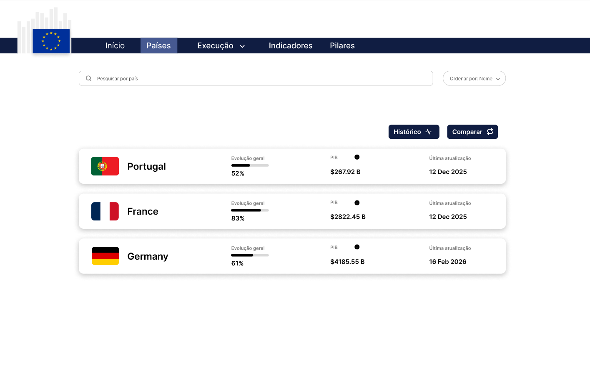
#### Figura 4: Captura de ecrã da página países

#### 3.2.1 Seleção de um País

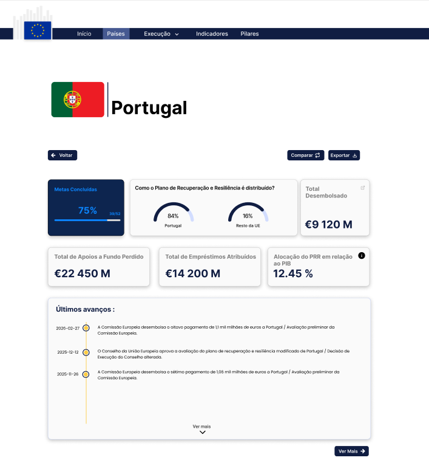
#### Figura 5: Captura de ecrã da página de detalhe de um país

Ao selecionar um país através da lista ou da pesquisa, o utilizador é redirecionado para a página de detalhe, o elemento central da interface. 

Esta página adota uma estratégia de revelação progressiva vertical, apresentando inicialmente o Sumário com os indicadores financeiros e de execução mais críticos.

No topo, a interface apresenta o progresso do plano de forma textual e visual (ex: "75% - Metas concluídas") através de uma barra de progresso linear. Esta escolha de design substitui gráficos circulares mais complexos por uma representação horizontal que facilita a leitura rápida do avanço do país.

Logo, três cartões principais apresentam: o Total Recebido, a Alocação PRR em relação ao PIB e o número de Projetos Ativos.

Junto a métricas que podem ser menos intuitivas, como o valor do PIB, são colocados ícones de informação ("i") que, ao serem sobrevoados, revelam tooltips explicativas. Este detalhe é particularmente importante para o perfil da **Clara**, que pode não estar familiarizada com estes conceitos financeiros e beneficia de ajuda contextual imediata.

Para complementar os dados estatísticos, foi incluída a secção "Últimos avanços", que apresenta uma linha temporal dos marcos e metas atingidos recentemente. Esta componente permite que a **Helena** visualize o histórico de execução de forma cronológica, oferecendo uma maior transparência sobre o ritmo de implementação do PRR no país selecionado. Toda esta informação é apresentada antes da secção expandível, acedida através do botão "Ver Mais", garantindo que o utilizador tem primeiro acesso aos dados mais relevantes.

Quando o utilizador clica em "Ver Mais", é apresentada uma nova vista onde este deve primeiro selecionar um pilar ou navegar para a secção de
Indicadores. Após selecionar um pilar, a página apresenta a informação detalhada do país para esse pilar específico.

Através da página de detalhes de um país é possível aceder ao seu total desembolsado. Esta paǵina apresenta o histórico detalhado dos pagamentos transferidos pela União Europeia e a lista das entidades que receberam os maiores montantes. O cabeçalho identifica visualmente o país em contexto, com a respetiva bandeira e nome.

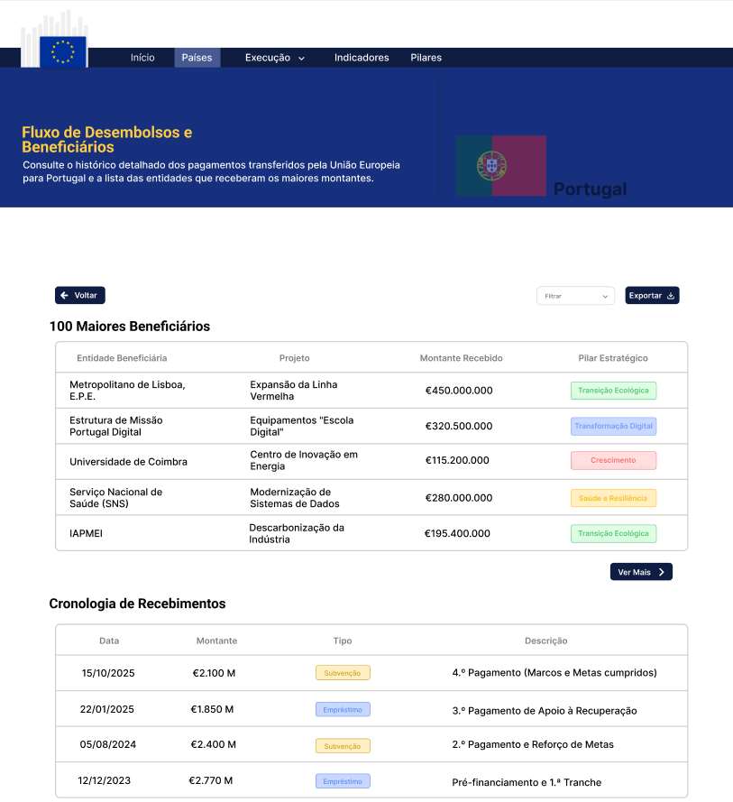
#### Figura 6: Captura de ecrã da secção "Desembolsos de um País"

A tabela **100 Maiores Beneficiários** lista as entidades por montante recebido, projeto associado e pilar estratégico correspondente. Cada pilar
é identificado por uma *tag* colorida (ex: verde para Transição Ecológica, azul para Transformação Digital), permitindo uma leitura rápida da
distribuição sectorial dos fundos. Para não sobrecarregar visualmente a página, apenas um subconjunto de entradas é apresentado inicialmente; ao
clicar em "Ver Mais", a tabela expande para mostrar todos os beneficiários, com a possibilidade de filtrar por pilar estratégico. Esta decisão de design
respeita o princípio de apresentação progressiva da informação, evitando a sobrecarga cognitiva. 

A opção de exportação permite à **Helena** obter os dados em formato editável para análise externa, e ao **Marco** utilizar
a informação em apresentações de pitch.

Abaixo, a tabela **Cronologia de Recebimentos** apresenta o histórico cronológico dos pagamentos recebidos pelo país, com as colunas Data,
Montante, Tipo (Subvenção ou Empréstimo, distinguidos por *tags* de cor diferente) e Descrição. 

Esta linha temporal de pagamentos permite à **Helena** verificar o ritmo de desembolso e cruzar as datas com os marcos
cumpridos, e à **Clara** compreender se os fundos prometidos estão efetivamente a ser transferidos.

#### 3.2.2 Histórico

Através do botão 'Histórico' presente nesta página é possível navegar para uma página onde é apresentado o histórico de revisões,funcionando como uma vista especializada para análise de logs e transparência administrativa. 

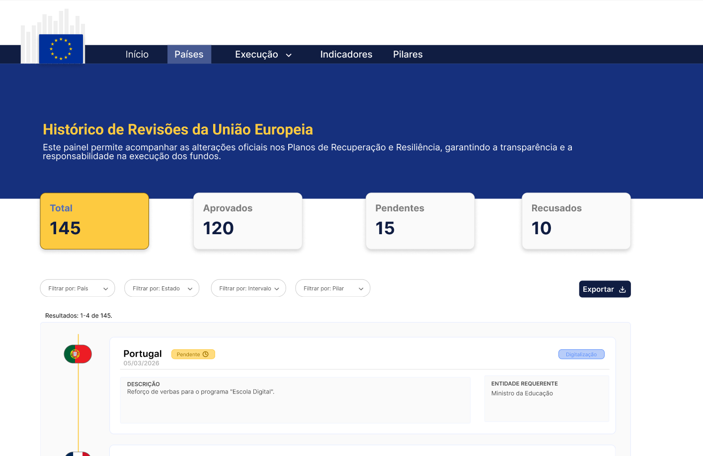
#### Figura 7: Captura de ecrã da secção Histórico

A interface apresenta o Histórico de Revisões da União Europeia, um painel focado na transparência e responsabilidade da execução dos fundos do Mecanismo de Recuperação e Resiliência. 

O corpo central da página é composto por uma lista cronológica de eventos ligada por uma linha vertical amarela, onde cada entrada detalha o país, o estado do processo (identificado por cores verde, amarela ou vermelha), a data, a descrição da medida e a entidade governamental requerente. 

O design desta página promove o **Controlo e Liberdade do Utilizador** ao oferecer múltiplos caminhos de navegação: o utilizador pode consultar revisões específicas dentro do detalhe de um país ou optar pela visão global no Histórico, permitindo que cada perfil (seja o analista de dados ou o cidadão comum) escolha a escala de detalhe que melhor serve os seus objetivos.

A inclusão de contadores de resultados ('A mostrar 1-10 de 145') e o uso de etiquetas coloridas (badges) para estados como Pendente ou Aprovado garantem que o utilizador compreende instantaneamente a situação de cada processo.

#### 3.2.3 Comparar

Uma das funcionalidades mais relevantes da interface é a possibilidade de comparar dois países lado a lado. 

Esta funcionalidade pode ser iniciada a partir de um botão "Comparar" disponível na lista de países ou na página de detalhe de um país (que irá ser explorada também neste documento).

O comportamento do diálogo de seleção adapta-se consoante o ponto de
entrada:

- **A partir da lista de países**: o utilizador vê um único campo de pesquisa
  e deve selecionar dois países distintos. À medida que seleciona cada país,
  este aparece como uma *tag* removível, permitindo que o utilizador desfaça
  a escolha caso pretenda substituir um dos países. Não é possível selecionar
  o mesmo país duas vezes, prevenindo comparações inválidas.

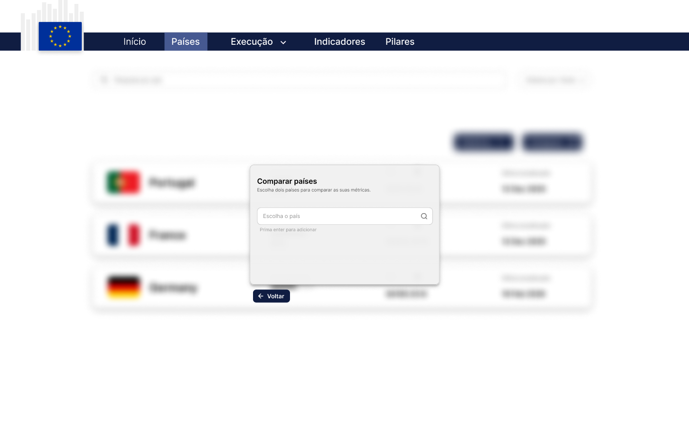
#### Figura 8: Captura de ecrã do menu de seleção de países para comparação

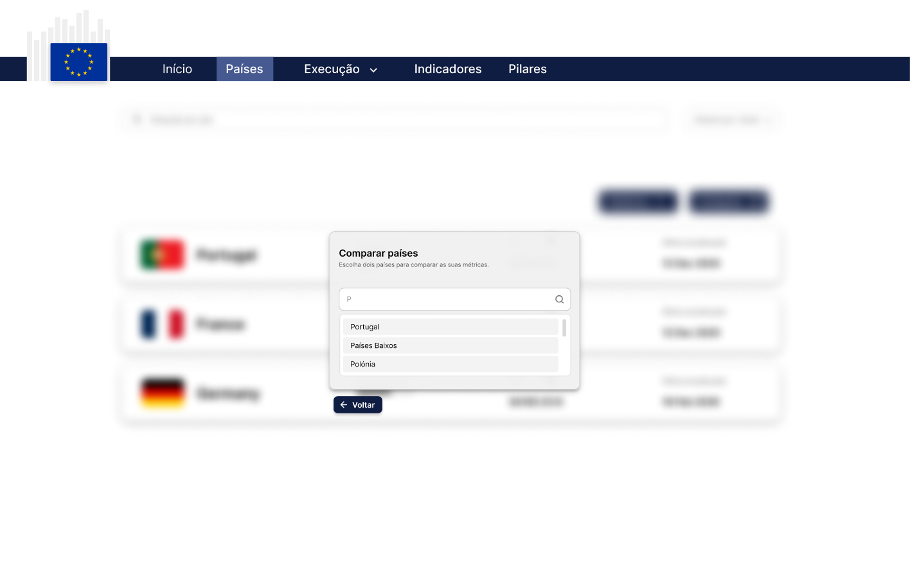
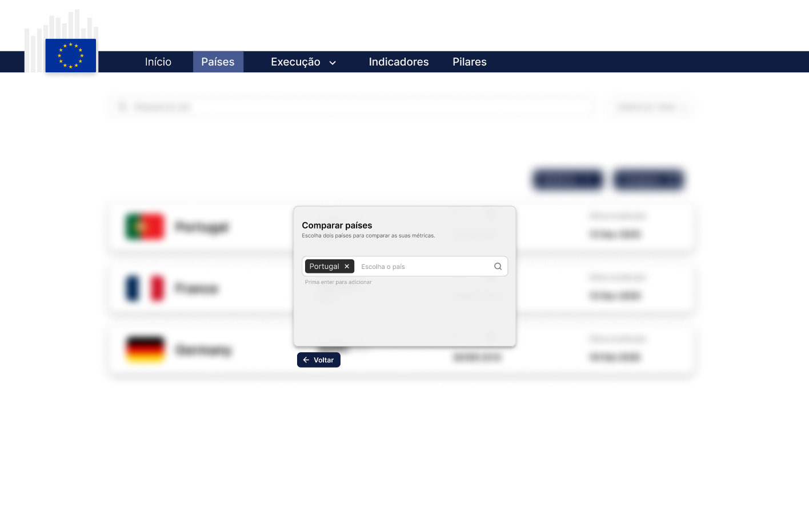
#### Figura 9: Captura de ecrã do menu de seleção com um país selecionado

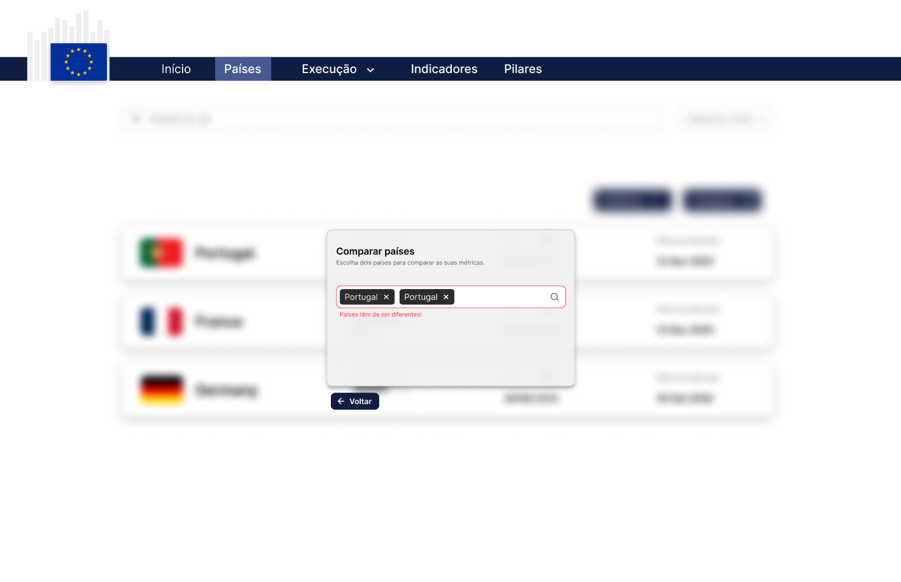
#### Figura 10: Erro no país selecionado

- **A partir da página de detalhe de um país**: o país atualmente visualizado
  surge pré-selecionado e fixo, não podendo ser removido. O utilizador apenas
  necessita de escolher um segundo país através do campo de pesquisa,
  reduzindo o número de passos necessários e evitando erros de contexto,
  uma decisão de design que respeita o princípio de reconhecimento em vez de
  recordação, uma vez que o utilizador não precisa de se lembrar do país que
  estava a consultar.

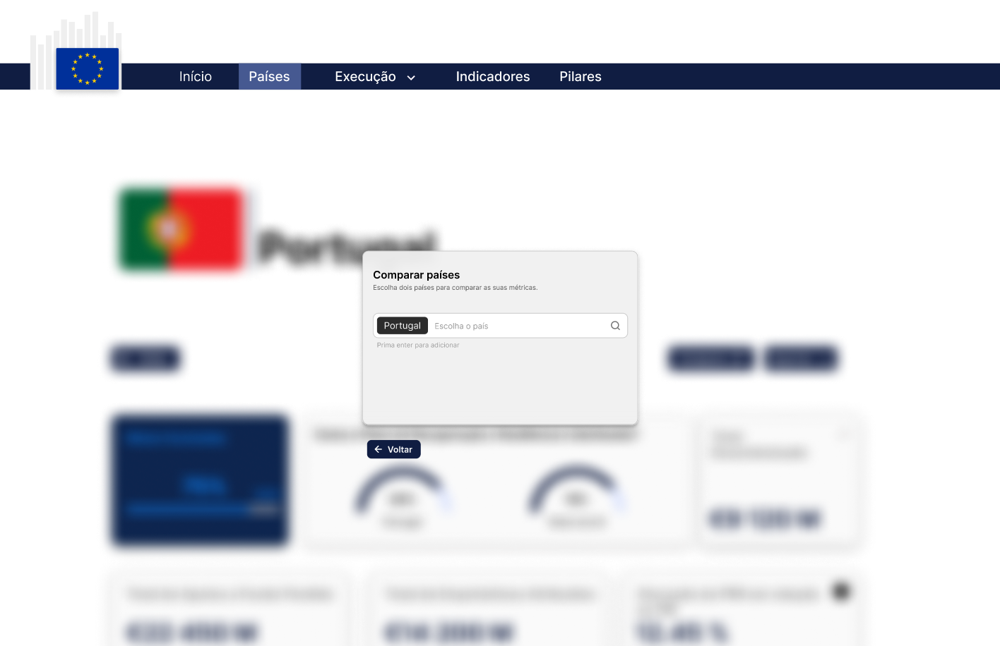
#### Figura 11: País já selecionado

Em ambos os casos, o botão "Comparar" só aparece quando dois países distintos estão selecionados, caso contrário, não aparece.

Este mecanismo de prevenção de erros evita que o utilizador inicie uma comparação incompleta.

Importa ainda referir que o campo de pesquisa, ao ser clicado, apresenta uma lista pré-carregada de todos os Estados-Membros da UE, facilitando a seleção mesmo quando o utilizador não se recorda do nome exato de todos os países disponíveis. 

A lista é progressivamente filtrada à medida que o utilizador digita, combinando assim a conveniência do reconhecimento visual com a eficiência da pesquisa por texto.

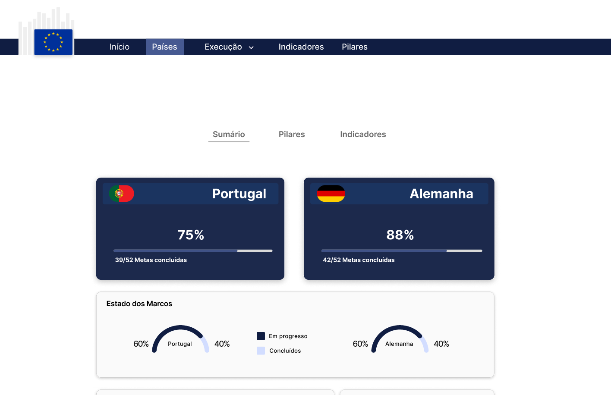
#### Figura 12: Captura de ecrã do resultado da comparação

A vista de comparação organiza-se em três separadores: **Sumário**, **Pilares** e **Indicadores**, permitindo ao utilizador navegar entre
diferentes níveis de detalhe sem abandonar o contexto de comparação.

No rodapé da página, o botão **"Voltar"** permite regressar à lista de países, enquanto o botão **"Exportar"** possibilita a exportação dos dados
comparativos, respondendo diretamente à necessidade do **Marco Rossi** de obter gráficos exportáveis para apresentações de pitch, e da **Helena** de
aceder a dados em formatos editáveis.

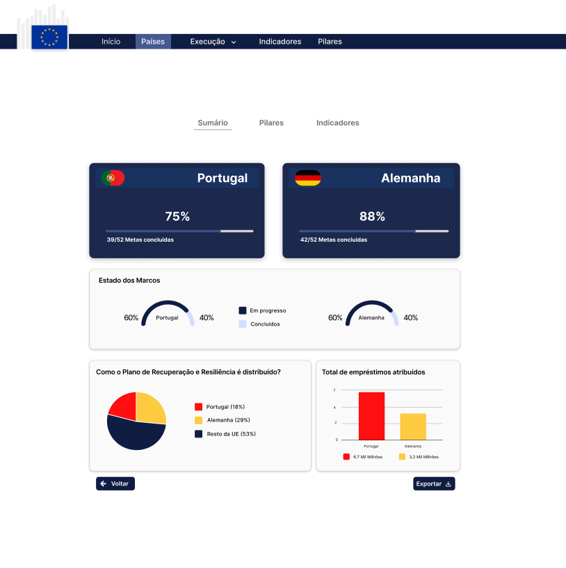
#### Figura 13: Captura de ecrã do separador "Sumário"

No separador **Sumário**, os dois países são apresentados em cartões paralelos com fundo escuro, exibindo de forma imediata a percentagem de
metas concluídas e o número absoluto. Esta disposição lado a lado permite que a **Clara Mendes** compare instantaneamente o desempenho entre países sem
necessidade de memorizar valores ou alternar entre páginas, respeitando o princípio de reconhecimento em vez de recordação.

Abaixo, o painel **Estado dos Marcos** apresenta dois gráficos semicirculares simétricos, um por país, mostrando a proporção entre marcos em progresso. A legenda partilhada entre os dois gráficos reforça a consistência visual e facilita a leitura comparativa.

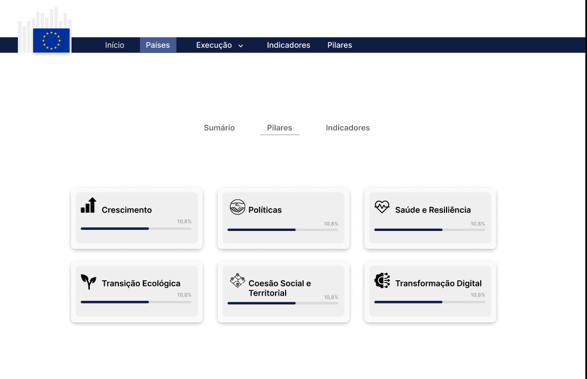
#### Figura 14: Captura de ecrã do separador "Pilares"

O separador **Pilares** replica a estrutura da página de detalhe individual de cada país, mas organizada em duas colunas paralelas, uma por país.
A informação de cada pilar é apresentada de forma alinhada horizontalmente, permitindo comparar diretamente os valores de ambos os países para cada
métrica. 

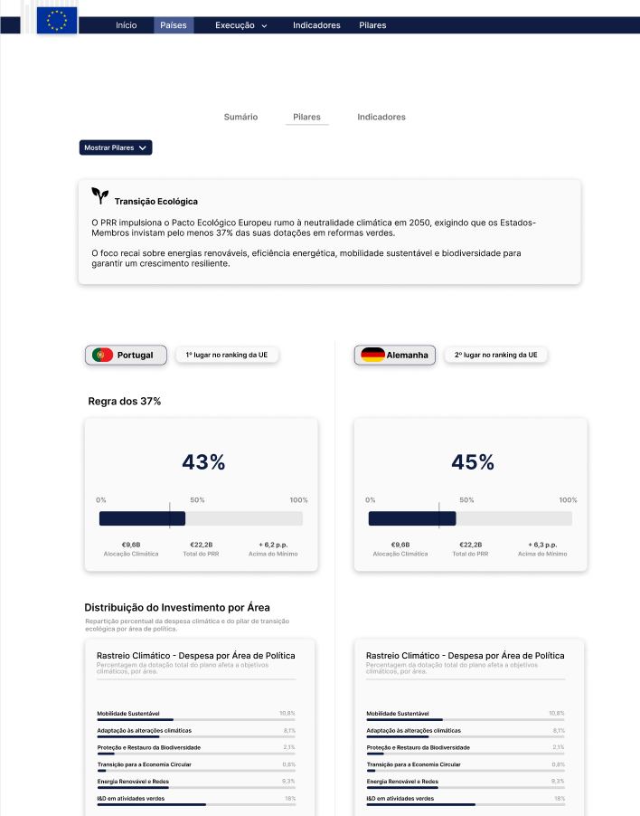
#### Figura 15: Escolha do pilar "Transição Ecológica"

O utilizador dispõe sempre de um botão "Mostrar Pilares" que expande ou recolhe um painel de seleção, permitindo-lhe trocar de pilar a qualquer momento sem perder o contexto da página. Esta decisão de design evita que o utilizador tenha de navegar para trás para mudar de pilar, reduzindo a fricção na exploração comparativa entre pilares, respondendo diretamente às necessidades do **Marco Rossi**, que pretende identificar em quais áreas dos diferentes pilares deve expandir a sua empresa, e da **Helena**, que
necessita de acesso rápido a metas específicas por setor.

Cada pilar é representado como um *card* clicável com ícone e nome. 

No topo, um cartão descritivo contextualiza o pilar selecionado, no caso da Transição Ecológica, é explicado o enquadramento no Pacto Ecológico
Europeu e os domínios de foco (energias renováveis, eficiência energética, mobilidade sustentável e biodiversidade). Esta descrição introdutória serve
especialmente o perfil da **Clara Mendes**, que beneficia de linguagem clara e acessível antes de ser exposta a dados quantitativos.

Ao clicar no *badge* de posicionamento apresentado na página de detalhe do país, o utilizador é redirecionado para a página global do pilar, que agrega
a informação de todos os Estados-Membros numa visão comparativa europeia.

### 3.3 Página Execução

A secção "Execução" é acessível através do menu de navegação principal e disponibiliza três subsecções: **Visão Geral**, **Metas e Marcos**, 
**Desembolsos**.

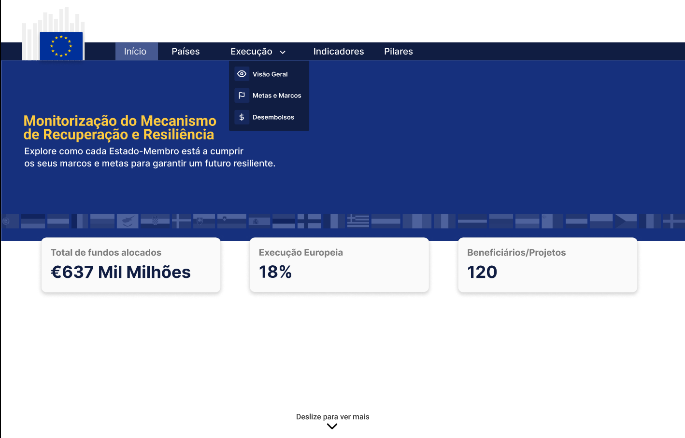
#### Figura 16: Captura de ecrã das opções de escolha

#### 3.3.1 Visão Geral de Execução

A página de Visão Geral agrega os dados de execução de todos os Estados-Membros numa única vista panorâmica. 

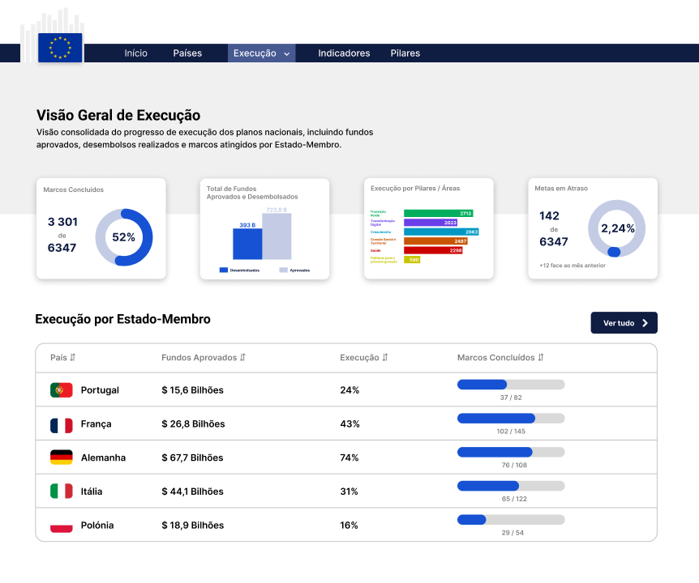
#### Figura 17: Captura de ecrã da página Visão Geral de Execução

No topo, quatro cartões de destaque apresentam as métricas globais mais relevantes: o número de marcos
concluídos, o total de fundos aprovados e desembolsados, a execução por pilares e áreas e o número de marcos atrasados. 

Esta visão macro responde diretamente às necessidades
da **Helena Vasconcelos**, que necessita de monitorizar o progresso real face aos marcos definidos, e do **Marco Rossi**, que pretende identificar
quais os países e pilares com maior volume de investimento.

Abaixo, a tabela **Execução por Estado-Membro** lista os países com as colunas País, Fundos Aprovados, Execução e Marcos Concluídos, esta última
representada por uma barra de progresso horizontal acompanhada do valor absoluto (ex: 37/82), tornando a comparação entre países imediata e
intuitiva. 

Todas as colunas são ordenáveis, permitindo ao utilizador reorganizar a tabela por ordem alfabética, por volume de fundos aprovados,
por percentagem de execução ou por marcos concluídos, respondendo à necessidade da **Clara Mendes** de comparar o desempenho entre países de
forma direta. 

O botão "Ver tudo" permite expandir a tabela para consultar todos os Estados-Membros.

#### 3.3.2 Metas e Marcos

A página de Metas e Marcos é introduzida por um cabeçalho com fundo escuro que contextualiza o seu propósito: apresentar o progresso na implementação
dos compromissos definidos nos Planos de Recuperação e Resiliência dos Estados-Membros.

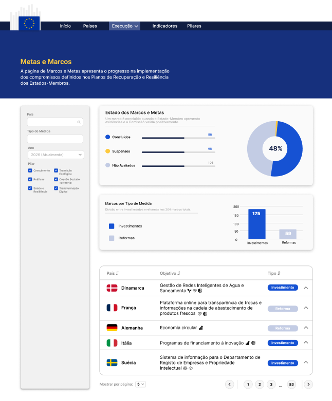
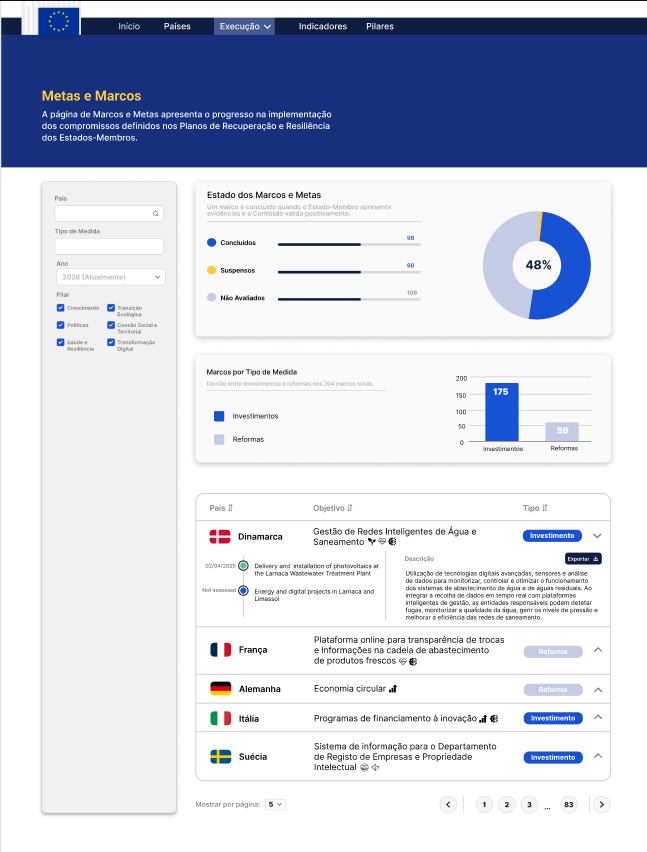
#### Figura 18: Captura de ecrã da página Metas e Marcos

À esquerda, um painel de filtros permite refinar os dados apresentados por **País**, **Tipo de Medida**, **Pilar** e **Ano**, sendo o ano atual
(2026) selecionado por omissão. Esta capacidade de filtragem granular é essencial para a **Helena**, que necessita de aceder a metas específicas
por setor, e permite à **Clara** isolar os dados relevantes para a sua
região ou área de interesse.

#### 3.3.3 Desembolsos

Esta página é um caminho alternativo ao utilizador que permite decidir diretamente qual o país ao qual pretende aceder à tabela de desembolsos.

### 3.4 Página "Indicadores"

A página "Indicadores" é acessível diretamente através da barra de navegação principal e apresenta os 14 indicadores comuns de reporte obrigatório 
por todos os Estados-Membros da União Europeia.

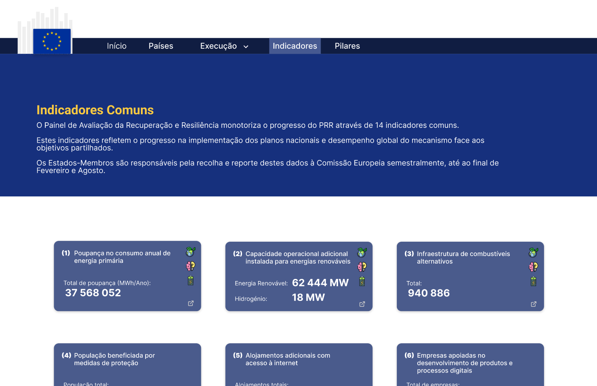
#### Figura 19: Captura de ecrã da página "Indicadores"

O cabeçalho da página, com fundo azul escuro, contextualiza o propósito da secção. Esta contextualização é especialmente importante para o perfil 
da **Clara Mendes**, que beneficia de uma introdução clara antes de ser exposta aos dados quantitativos.

Imediatamente abaixo do cabeçalho, são apresentados os primeiros cartões de indicadores, cada um identificado pelo número e nome do indicador, acompanhado de ícones representativos e do valor agregado europeu (por exemplo: o Indicador 1: Poupança no consumo anual de energia primária, apresenta o valor total de 37 568 052 MWh/Ano). 

Um ícone de ligação externa em cada cartão permite ao utilizador aceder ao detalhe completo do indicador, respeitando o princípio de revelação progressiva.

No topo da página de detalhe de cada indicador, um botão "Mostrar Indicadores" abre um painel com a lista dos 14 indicadores numerados, permitindo ao utilizador navegar diretamente entre indicadores sem regressar à página de listagem. 

À direita deste botão, uma barra de destaque apresenta o valor agregado do indicador atualmente selecionado (ex: "Total de poupança 37 568 052 (MWh/Ano)"), garantindo que o contexto quantitativo global está sempre visível.

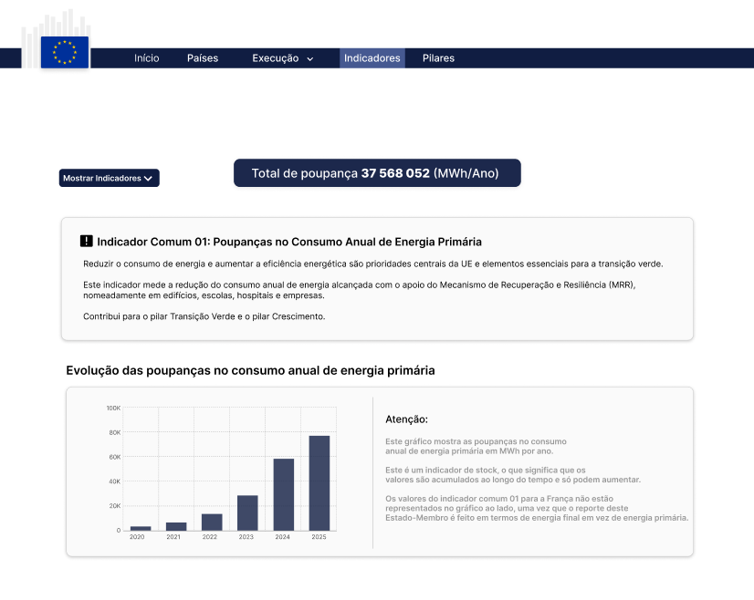
#### Figura 20: Indicador 1

A página de detalhe de cada indicador organiza-se em três blocos principais:
- No topo, um cartão descritivo contextualiza o indicador com linguagem acessível. Esta descrição, como já foi mencionada, serve diretamente o perfil da **Clara**, que necessita de linguagem clara e de compreender o impacto concreto no quotidiano.

- De seguida, é apresentado o gráfico de evolução temporal do indicador, neste caso, um gráfico de barras verticais que mostra a progressão anual das poupanças em MWh/Ano. 
À direita do gráfico, uma caixa de "Atenção" apresenta notas metodológicas relevantes, como, no caso do Indicador 1 o facto de se tratar de um indicador de stock (valores acumulados que só podem aumentar) e de os dados da França não estarem representados por serem reportados em termos de energia final em vez de energia primária. 
Esta transparência metodológica é fundamental para a **Helena Vasconcelos**, que necessita de compreender as limitações dos dados antes de os utilizar em análises.

### 3.5 Página "Pilares"

A página "Pilares" é acessível tanto através da barra de navegação principal como através do badge de posicionamento no ranking presente na página de detalhe de cada país. Esta página agrega a informação de todos os Estados-Membros numa visão comparativa europeia para o pilar selecionado.

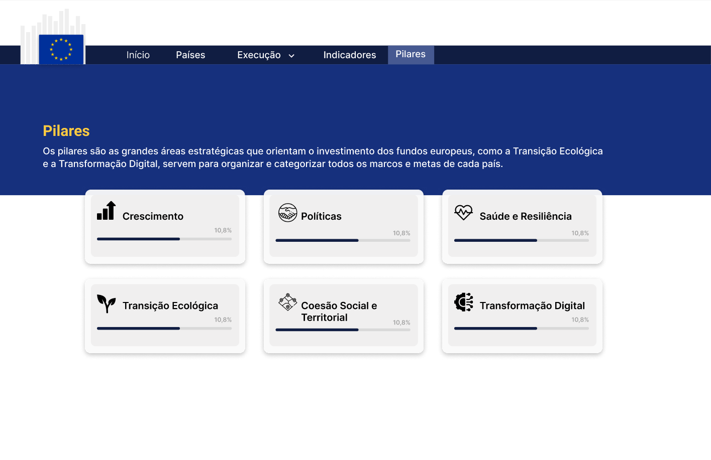
#### Figura 21: Captura de ecrã da página Pilares

A entrada na página apresenta uma grelha de seis cards clicáveis, cada um representando um pilar temático do PRR. 

Esta estrutura serve todos os perfis de utilizador: a **Helena** acede diretamente ao pilar de interesse para a sua análise, o **Marco** navega para Transição Ecológica ou Transformação Digital em função dos seus objetivos de negócio, a **Clara** pode explorar o pilar de Políticas para a Próxima Geração para comparar investimentos em educação.

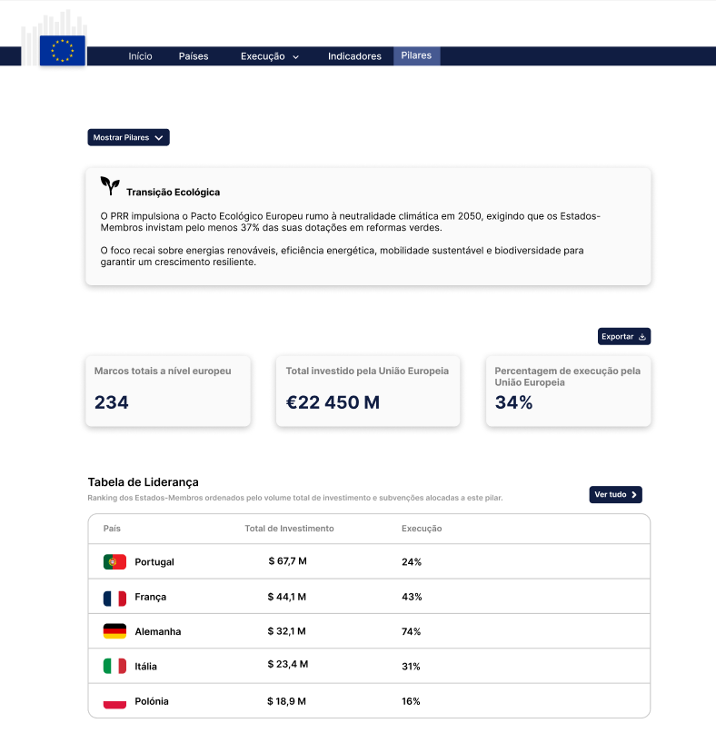
#### Figura 22: Vista de detalhe do pilar Transição Ecológica

Após selecionar um pilar, a página organiza-se em duas zonas:
- No topo, um botão "Mostrar Pilares" permite ao utilizador trocar de pilar a qualquer momento sem perder o contexto da análise. Abaixo, um cartão descritivo contextualiza o pilar selecionado, no caso da Transição Ecológica.
-De seguida, três cartões de destaque apresentam as métricas agregadas a nível europeu para o pilar selecionado. 
Esta visão macro permite que o Marco Rossi contextualize rapidamente o estado geral do pilar à escala europeia antes de aprofundar a análise por país.

A secção principal da página é a Tabela de Liderança, que apresenta os Estados-Membros ordenados pelo volume total de investimento alocado ao pilar, com as colunas País (com bandeira), Total de Investimento e Execução. 

### 3.6 Rodapé (*Footer*)

O rodapé da interface, embora a navegação principal esteja sempre acessível através da *navbar* fixa no topo, cumpre um conjunto de funções
complementares que justificam a sua presença.

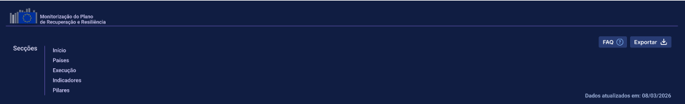
#### Figura 23: Captura de ecrã do rodapé de todas as páginas

À esquerda, replica as ligações para as secções principais da aplicação (Início, Países, Execução, Indicadores e Pilares). Embora redundante face
à *navbar*, esta repetição é uma convenção estabelecida na web que os utilizadores reconhecem e esperam, especialmente após percorrerem uma
página longa, quando fazer *scroll* até ao topo para navegar representaria um esforço desnecessário.

À direita, dois elementos de utilidade global completam o rodapé: um botão **FAQ**, que oferece acesso a ajuda contextual sem interromper o fluxo de
navegação, particularmente útil para a **Clara Mendes**, que pode não estar familiarizada com conceitos financeiros ou técnicos do PRR, e um botão
**Exportar**, que disponibiliza a exportação de dados a partir de qualquer ponto da aplicação, sem obrigar o utilizador a navegar até uma página
específica para o fazer.

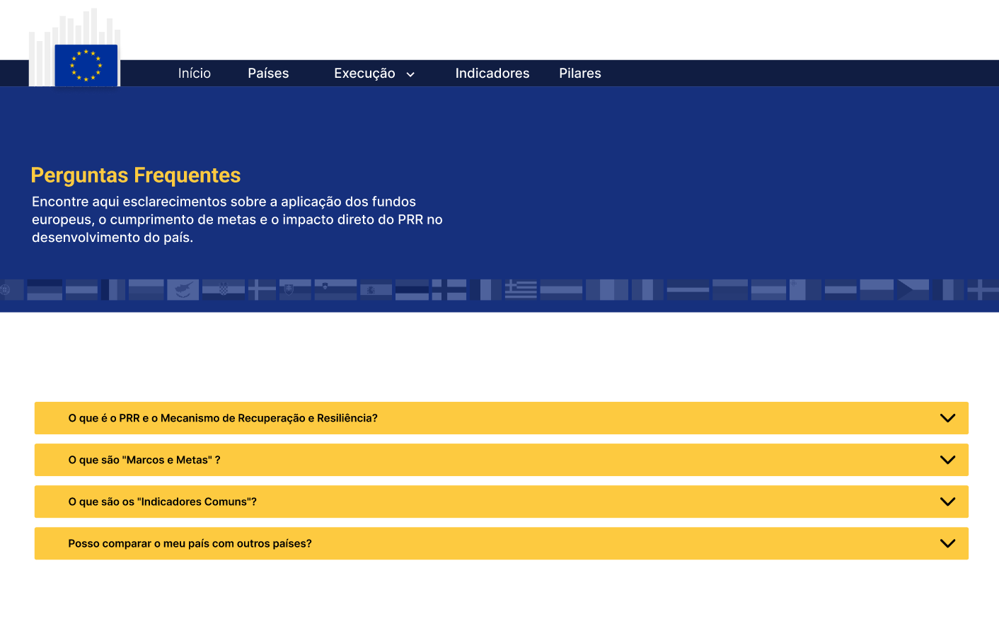
#### Figura 24: Captura de ecrã da secção FAQ

Por fim, a indicação **"Dados atualizados em: 08/03/2026"** transmite de forma transparente a frescura dos dados apresentados, respondendo à
necessidade da **Helena** de verificar a atualidade da informação antes de a utilizar em análises ou relatórios.

---

## 4. Avaliação Heurística

A interface foi avaliada com recurso às Heurísticas de Nielsen [\[2\]](#referências). Cada elemento do grupo avaliou os fluxos em que menos participou, e os problemas encontrados foram corrigidos ou registados como melhorias futuras.

### 4.1 Visibilidade do Estado do Sistema

O *dashboard* apresenta de imediato indicadores-chave (fundos alocados, execução, marcos concluídos). Na página de detalhe, barras de progresso comunicam o estado de execução instantaneamente. Na filtragem de dados, *chips* com os filtros ativos garantem visibilidade sobre os critérios aplicados. **Melhoria futura:** adicionar *spinners* de carregamento para conexões lentas.

### 4.2 Correspondência com o Mundo Real e Reconhecimento em vez de Recordação

A terminologia utilizada é familiar ao domínio ("Marcos", "Metas", "Pilares", "Desembolsos"), e bandeiras nacionais, ícones temáticos e mapas interativos tiram partido do conhecimento prévio dos utilizadores. Os tipos de gráfico escolhidos (barras, *donuts*) são amplamente conhecidos, garantindo acessibilidade mesmo para utilizadores como a **Clara**. Os pilares são apresentados como *tags* com ícone e nome, dispensando memorização, na lista de países, bandeiras e indicadores são visíveis sem interação, e na comparação os dados alinhados lado a lado eliminam a necessidade de memorizar valores.

### 4.3 Controlo, Liberdade e Flexibilidade de Utilização

A barra de navegação principal está sempre visível, permitindo regressar a qualquer secção, e no fluxo de comparação é possível alterar a seleção sem reiniciar o processo. A pesquisa por nome e os filtros rápidos servem utilizadores experientes como a **Helena**, enquanto a navegação sequencial e o *ranking* Top 3 servem utilizadores menos experientes. A exportação de dados filtrados poupa tempo a quem sabe o que procura. **Melhorias futuras:** botão "Voltar ao topo" em páginas com *scroll* extenso e atalhos de teclado para ações frequentes.

### 4.4 Consistência e Normas

A barra de navegação, cartões de resumo, botões de ação e separadores mantêm-se idênticos em todos os ecrãs. A iconografia segue as *Material Icons* [\[3\]](#referências), e os efeitos de *hover* são uniformes em todos os elementos clicáveis. Optou-se por um *dropdown* (em vez de diálogo) para exportação, priorizando rapidez sobre consistência total com o fluxo de comparação.

### 4.5 Prevenção e Recuperação de Erros, Ajuda e Documentação

Na comparação de países, o botão "Comparar" fica desativado até dois países serem selecionados. Ícones "i" junto a métricas menos intuitivas fornecem *tooltips* explicativas, e *tooltips* contextuais proporcionam micro-ajuda *inline* sem abandonar o contexto da análise.

### 4.6 Estética e Desenho Minimalista

Paleta contida (azul-escuro, branco, acentos subtis), tipografia limpa e espaçamento generoso. Separadores e secções colapsáveis dividem grandes volumes de dados em vistas coerentes. *Tooltips* complementam elementos visuais sem poluir a interface permanentemente.

---

## 5. Conclusão e Trabalho Futuro

Ao longo das últimas semanas, foi prototipada uma interface para uma plataforma de visualização de dados sobre a execução dos Planos Nacionais de Recuperação e Resiliência. Os três perfis de utilizador fornecidos, a Helena, o Marco e a Clara, foram utilizados para modelar a interface com base nas características e necessidades destes utilizadores hipotéticos, garantindo que a solução responde a diferentes níveis de literacia de dados e diferentes objetivos de utilização.

Por fim, foi feita uma análise heurística da interface prototipada com base nas heurísticas de Nielsen [\[2\]](#referências), tendo sido identificados e corrigidos alguns problemas. Foram também identificados aspetos menos críticos, como a adição de indicadores de carregamento, atalhos de teclado e páginas de erro, que não implicam grandes alterações à arquitetura atual da interface e podem ser abordados na próxima iteração.

---

## Referências

1. Figma, "Figma: Collaborative Interface Design Tool." [Online]. Available: <https://www.figma.com/>
2. Nielsen Norman Group, "10 Usability Heuristics for User Interface Design." [Online]. Available: <https://www.nngroup.com/articles/ten-usability-heuristics/>
3. Google Fonts, "Material Symbols & Icons." [Online]. Available: <https://fonts.google.com/icons>
4. European Commission, "Recovery and Resilience Scoreboard." [Online]. Available: <https://ec.europa.eu/economy_finance/recovery-and-resilience-scoreboard/>
